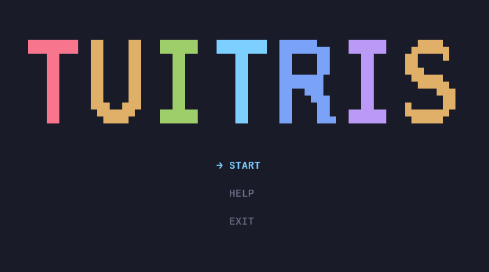
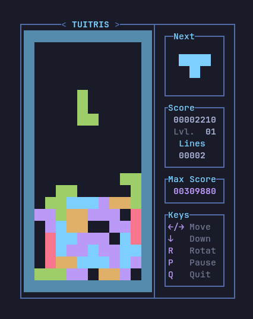

# Tuitris

Tetris clone TUI for the terminal. Written in pure C with no external libraries, rendering is raw ANSI escape sequences, raw-mode input with alt-screen, pthreads for the game loop, and no memory allocations.


<table width="100%" border="0" cellspacing="0" cellpadding="0">
<tr>
<td width="68%"></td>
<td width="32%"></td>
</tr>
</table>

## Requirements

- gcc and make
- POSIX system
- Terminal with UTF-8 and ANSI color support

## Run

```sh
make run    # build and run
```

## Controls

| Key | Action |
| --- | --- |
| Up / Down | Navigate the menu |
| Enter | Select menu item |
| Left / Right | Move piece left / right |
| Down | Move piece down |
| R or Space | Rotate clockwise |
| P | Pause / resume |
| H | Show help |
| Q | Quit to menu |

## Features

- 10 by 20 board with seven tetromino types.
- Side panel with game stats.
- Next-piece preview.
- Max score across runs.
- Pause screen and help.
- Title art picks over three sizes based on terminal size.

## Scoring

- 10 points per new piece
- `1000 * level * lines * lines` for clearing lines.
- Level is `1 + lines cleared / 10`
- Speed increase every 10 lines cleared, delays 1000ms down to 100ms.

## Layout

```
main.c        menu loop and entry point
inc/          headers
  board.h     board grid
  color.h     colors
  game.h      game loop
  help.h      help screen
  input.h     key events
  menu.h      main menu
  state.h     game stats
  tetromino.h pieces
  ui.h        game screen drawing
  ui_assets.h constanta for ui
  tdraw.h     header-only terminal drawing helpers
src/          implementations
```

## License

MIT. See [LICENSE](LICENSE).
